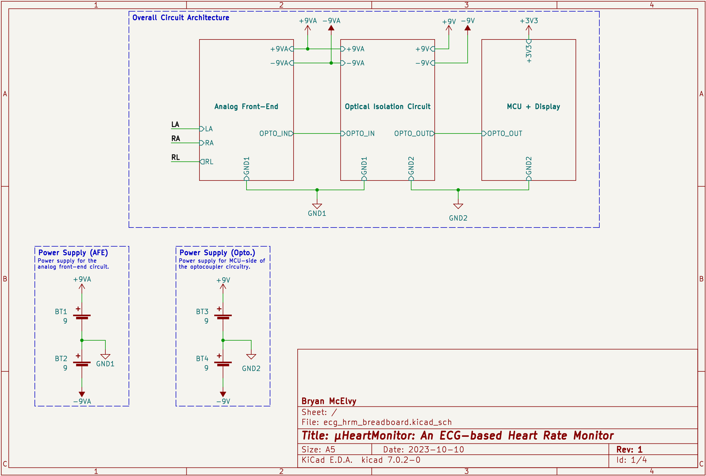
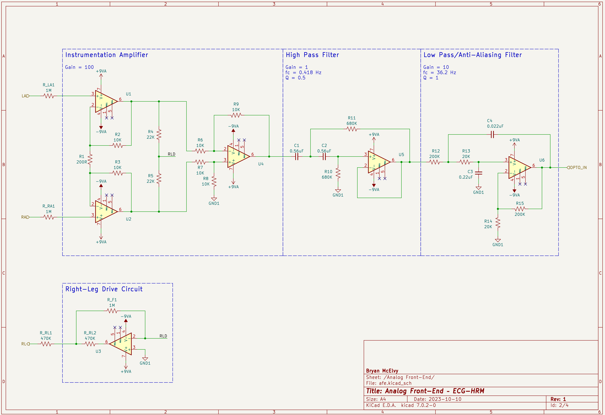

# μHeartMonitor: An ECG-based Heart Rate Monitor

An electrocardiogram-based heart rate monitor project implemented with a TM4C123 microcontroller and custom analog front-end circuitry. Please read below for more information on what exactly this project is and why I decided to do it!

## Table of Contents

 ❗️ Click to see table of contents ❗️ 

- [μHeartMonitor: An ECG-based Heart Rate Monitor](#μheartmonitor-an-ecg-based-heart-rate-monitor)
  - [Table of Contents](#table-of-contents)
  - [Summary](#summary)
    - [What is this?](#what-is-this)
    - [How does it work?](#how-does-it-work)
    - [How is this repository organized?](#how-is-this-repository-organized)
    - [Why'd you do all of this?](#whyd-you-do-all-of-this)
  - [Navigating the Repository](#navigating-the-repository)
  - [Introduction](#introduction)
    - [Background](#background)
    - [Motivation](#motivation)
    - [Disclaimer](#disclaimer)
    - [Key Terms](#key-terms)
  - [Materials \& Methods](#materials--methods)
    - [Hardware](#hardware)
      - [Analog-Front End](#analog-front-end)
      - [Optical Isolation Circuitry](#optical-isolation-circuitry)
      - [Microcontroller Circuit](#microcontroller-circuit)
    - [Software Architecture](#software-architecture)
      - [Device Drivers](#device-drivers)
      - [Middleware](#middleware)
      - [Application-specific Software](#application-specific-software)
      - [External](#external)
      - [Common](#common)
  - [Current Results](#current-results)
  - [To-do](#to-do)
    - [Hardware](#hardware-1)
    - [Software](#software)
  - [Build Instructions](#build-instructions)
    - [Hardware](#hardware-2)
    - [Software](#software-1)
  - [References](#references)

## Summary

### What is this?
μHeartMonitor is a personal project that I made to increase my experience in embedded software engineering and apply my previous coursework in biomedical engineering. Essentially, it's a fully-functional, ECG-based heart rate monitor that runs on the popular Tiva LaunchPad evaluation kit for the TM4C123 microcontroller.

### How does it work?
An electrocardiogram (or ECG) is a plot of the electrical activity of the heart over time. The hardware in this project senses a patient's ECG signal and transmits it to the microcontroller circuit. The microcontroller receives, processes, and analyzes this signal to determine the average heart rate throughout the previous 5 seconds of monitoring time. It also displays both the waveform and the heart rate to a liquid crystal display (LCD).

### How is this repository organized?
The next section of the `README` goes into a bit more detail, but the vast majority of the project-specific source code is within the [`/src`](/src) directory, which hosts different modules (i.e. pairs of `*.c` and `*.h` files) that each implement a particular aspect of the project. The primary code is located in [`main.c`](/src/main.c). 

The [`/docs`](/docs/) directory hosts the project's [reference manual](/docs/refman.pdf), the diagrams explained later in this `README`, and external resources.

The project is primarily built using CMake, which generates Makefiles based on the commands in each of the different `CMakeLists.txt` files present in many of the directories.

### Why'd you do all of this?
Because I was interested in doing it and saw utility in doing so.

[🔼 BACK TO TOP 🔼](#μheartmonitor-an-ecg-based-heart-rate-monitor)

## Navigating the Repository

 ❗️ Click to see navigation ❗️ 

* [`/cmake_files`](cmake_files) - CMake-specific files for generating the build system.
* [`/docs`](docs) - Documentation for both the project itself and resources used in creating it.
  * [`/doxygen_files`](/docs/doxygen_files) - Files used for documentation generation via Doxygen.
  * [`/resources/articles`](docs/resources/articles) - Research articles and application notes.
  * [`/resources/books`](docs/resources/books) - Open-source/freely available textbooks.
  * [`/resources/datasheets`](docs/resources/datasheets) - Datasheets for hardware components.
  * [`/resources/help`](docs/resources/help) - Help text for a few of the command line-based applications used in this project.
  * [`/resources/manuals`](docs/resources/manuals) - PDF manuals for some of the software used in this project.
* [`/external`](external) - External software used in this project.
  * [`/CMSIS`](external/CMSIS) - Core CMSIS library by ARM for Cortex-M devices.
  * [`/CMSIS-DSP`](external/CMSIS-DSP/) - DSP library by ARM for Cortex-M devices.
* [`/src`](src) - Source code for the software modules written for this project.
  * [`/app`](/src/app) - Application-specific modules.
  * [`/common`](/src/common) - General-purpose modules used by other modules.
  * [`/device`](/src/device) - Device-specific files.
  * [`/drivers`](/src/drivers) - Low-level device drivers for the peripherals used in this project.
  * [`/middleware`](/src/middleware) - Software modules for interfacing with external hardware via device drivers.
  * [`/old_or_unused`](/src/old_or_unused) - Old or unused software modules.
  * [`/test_scripts`](/src/test_scripts) - Scripts used for manual on-target testing.
* [`/test`](test) - CppUTest-based unit test suite.
  * [`/mocks`](/test/mocks) - CppUMock-based mock functions used to substitute a module's depenencies during unit tests.
  * [`/src`](/test/src) - Source code for unit tests.
  * [`/stubs`](/test/stubs) - Hard-coded stub functions used to substitute a module's depenencies during unit tests.
* [`/tools`](tools) - Miscellaneous tools used or created for this project.
  * [`/cppcheck`](/tools/cppcheck) - Suppressions list for Cppcheck.
  * [`/data`](/tools/data) - ECG sample data from the publically available MIT-BIH Arrhythmia Database, as well as a Python script to convert them to `csv` files.
  * [`/filter_design`](/tools/filter_design) - Python scripts/notebooks used to design the digital filters used in this project.
  * [`/JDS6600`](/tools/JDS6600) - Scripts for interfacing a JDS6600 DDS Signal Generator/Counter.
  * [`/lookup_table`](/tools/lookup_table) - Script for generating the lookup table used in the ADC module.

 

## Introduction 

### Background
Electrocardiography (or ECG) is a diagnostic technique in which the electrical activity of a patient's heart is captured as time series data (AKA the ECG signal) and analyzed to assess cardiovascular health. Specifically, the ECG signal can be analyzed to detect biomarkers for cardiovascular diseases like arrhythmia, myocardiocardial infarction, etc. which manifest as abnormalities in the ECG waveform. In clinical environments, ECG is performed using machines that implement the required hardware and software to acquire, process, and analyze the ECG signal. This must be done in such a way that preserves the important information within the signal while also maintaining the safety of the patient.

The μHeartMonitor is an embedded system that implements the Pan-Tompkins algorithm for QRS detection to calculate a patient's heart rate from their ECG signal. The system consists of both hardware and software that cooperate to achieve this task while also visually outputting the waveform and heart rate to a liquid crystal display (LCD). The text below and the contents of this repository reflect the current progress made, but the end goal is to have the full system mounted on 1-2 printed circuit boards (PCBs) and situated inside an insulated enclosure.

### Motivation
My primary motivations for doing this project are:
* Learning more about and gaining exposure to the many different concepts, tools, and challenges involved in embedded systems engineering
* Applying the skills and knowledge I gained from previous coursework, including but not limited to:
  * BIOE 4315: Bioinstrumentation
  * BIOE 4342: Biomedical Signal Processing
  * COSC 2306: Data Programming
  * [Embedded Systems – Shape the World](https://users.ece.utexas.edu/~valvano/Volume1/E-Book/)
* Showing tangible proof of qualification for junior-level embedded software engineering roles to potential employers

I also hope that anyone interested in any of the fields of knowledge relevant to this project (biomedical/electrical/computer/software engineering) will find this helpful to look at or even use in their own projects.

### Disclaimer
This project is neither a product nor a medical device (by any legal definition, anyway), and is not intended to be either or both of things now or in the future. It is simply a resume-building passion project.

### Key Terms
WIP
* Analog front-end (AFE)
* Electrocardiogram/Electrocardiography (ECG)
* Heart rate monitor

[🔼 BACK TO TOP 🔼](#μheartmonitor-an-ecg-based-heart-rate-monitor)

## Materials & Methods

### Hardware

 ❗️ Click to see overall circuit ❗️ 

 

The hardware is divided into three modules: the analog-front end (AFE), the optical isolation circuit, and the microcontroller/display circuit.

#### Analog-Front End

 ❗️ Click to see analog-front end circuit schematic❗️

 

The AFE consists of an instrumentation amplifier with a gain of $100$; a 2nd-order Sallen-Key high-pass filter with a gain of $1$ and a cutoff frequency of $0.5$ $Hz$; and a 2nd-order Sallen-Key low-pass filter with a passband gain of $10$ and a cutoff frequency of $40$ $Hz$.

#### Optical Isolation Circuitry

 ❗️ Click to see optical isolation circuit schematic❗️ 

 

The optical isolation circuit uses a linear optocoupler to transmit the ECG signal from the analog-front end circuit to the microcontroller circuit. This circuitry serves as a safety measure against power surges and other potential hazards that can occur as a result of connecting someone directly to mains power (for example, death). 

It also has three resistors on the AFE-side that effectively shift the signal from the projected output range of ±$5.5$ $V$ to the range $[0, 3.5)$ $V$, which is necessary for both the optocoupler and the microcontroller's built-in analog-to-digital converter (ADC) circuitry.

#### Microcontroller Circuit

 ❗️ Click to see microcontroller circuit schematic❗️ 

 

The microcontroller circuit currently consists of a TM4C123 microcontroller mounted on a LaunchPad evaluation kit, and an MSP2807 liquid crystal display (LCD).

### Software Architecture

The call graph and data flow graph (visible through the dropdowns below) visually represent the software architecture.

 ❗️ Click to see call graph ❗️ 

This graph shows which modules communicate with (or "call") each other. Each arrow points from the "caller" to the "callee".

It also somewhat doubles as an `#include` dependency graph.

 

 ❗️ Click to see data flow graph ❗️ 

This graph shows the flow of information from the patient to the LCD (and also the laptop).

 

The software has a total of 14 modules, 11 of which are (somewhat loosely) divided into three layers: application-specific software, middleware, and device drivers.

#### Device Drivers
The device driver layer consists of software modules that interface directly with the microcontroller's built-in peripheral devices.

#### Middleware
The middleware layer consists of higher-level device drivers that interface with some hardware connected to one of the built-in peripherals (i.e. the Debug module connects to UART and the ILI9341 module primarily uses SPI).

#### Application-specific Software
The application-specific software layer has modules that are at least partially, if not completely built for this project. This layer includes the data acquisition module, whose functions handle receiving raw input samples and denoising them; the QRS detector, which analyzes the filtered signal to determine the average heart rate; and the LCD module, which plots the ECG waveform and displays the heart rate.

#### External
This "layer" includes any and all modules that were not written (or at least heavily altered) by me. It currently only contains the CMSIS-DSP library (or more specifically, the functions from it that are used by this project).

#### Common
The "common" modules are general-purpose modules that don't necessarily fit into the above categories/layers. This category includes the "Fifo" module, which contains a ring buffer-based implementation of the FIFO buffer (AKA "queue") data structure; and "NewAssert", which is essentially just an implementation of the `assert` macro causes a breakpoint (and also doesn't cause a linker error like the built-in one does for some reason).

[🔼 BACK TO TOP 🔼](#μheartmonitor-an-ecg-based-heart-rate-monitor)

## Current Results
WIP

[🔼 BACK TO TOP 🔼](#μheartmonitor-an-ecg-based-heart-rate-monitor)

## To-do
### Hardware
* Design a custom PCB
  * Replace most of the AFE circuitry with an AFE IC (e.g. AD8232)
  * Add electrostatic discharge (ESD) protection
  * Add decoupling capacitors

### Software
* Rework the structure of/relationship between the LCD and ILI9341 modules
* Refactor ADC module to be more general
* Refactor SPI module to be more general
* Remove statically-allocated data structures for unused Timers and GPIO ports
* Add remaining parts of the Pan-Tompkins algorithm
  * Thresholding procedure for bandpass-filtered signal (not just integrated signal)
  * Search-back procedure
  * T-wave discrimination
* Add heart rate variability (HRV) calculation
* Move CMSIS-DSP filters from DAQ and QRS modules to their own module
* Expand the automated test suite.

[🔼 BACK TO TOP 🔼](#μheartmonitor-an-ecg-based-heart-rate-monitor)

## Build Instructions
### Hardware
WIP

### Software
WIP

[🔼 BACK TO TOP 🔼](#μheartmonitor-an-ecg-based-heart-rate-monitor)

## References

[1]&emsp;J. Pan and W. J. Tompkins, “A Real-Time QRS Detection Algorithm,” IEEE Trans. Biomed. Eng., vol. BME-32, no. 3, pp. 230–236, Mar. 1985, doi: 10.1109/TBME.1985.325532.

[2]&emsp;R. Martinek et al., “Advanced Bioelectrical Signal Processing Methods: Past, Present and Future Approach—Part I: Cardiac Signals,” Sensors, vol. 21, no. 15, p. 5186, Jul. 2021, doi: 10.3390/s21155186.

[3]&emsp;C. Ünsalan, M. E. Yücel, and H. D. Gürhan, Digital Signal Processing using Arm Cortex-M based Microcontrollers: Theory and Practice. Cambridge: ARM Education Media, 2018.

[4]&emsp;B. B. Winter and J. G. Webster, “Driven-right-leg circuit design,” IEEE Trans Biomed Eng, vol. 30, no. 1, pp. 62–66, Jan. 1983, doi: 10.1109/tbme.1983.325168.

[5]&emsp;J. Valvano, Embedded Systems: Introduction to ARM Cortex-M Microcontrollers, 5th edition. Jonathan Valvano, 2013.

[6]&emsp;S. W. Smith, The Scientist and Engineer’s Guide to Digital Signal Processing, 2nd edition. San Diego, Calif: California technical Publishin, 1999.

[🔼 BACK TO TOP 🔼](#μheartmonitor-an-ecg-based-heart-rate-monitor)

