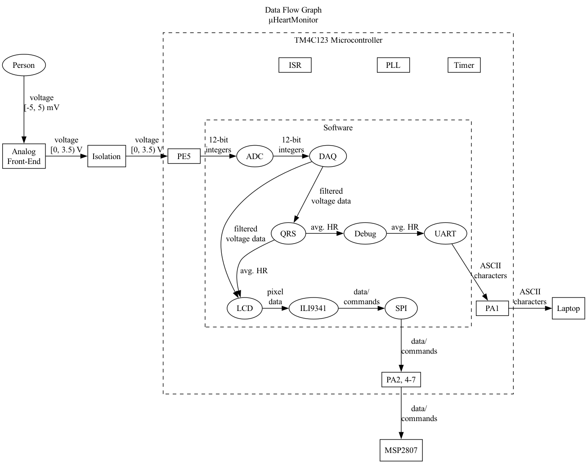

# μHeartMonitor: An ECG-based Heart Rate Monitor

An electrocardiogram-based heart rate monitor project implemented with a TM4C123 microcontroller and custom analog front-end circuitry. Please read below for more information on what exactly this project is and why I decided to do it!

- [μHeartMonitor: An ECG-based Heart Rate Monitor](#μheartmonitor-an-ecg-based-heart-rate-monitor)
  - [Navigation](#navigation)
  - [Introduction](#introduction)
    - [Background](#background)
    - [Motivation](#motivation)
    - [Key Terms](#key-terms)
  - [Materials \& Methods](#materials--methods)
    - [Hardware](#hardware)
    - [Software](#software)
  - [Current Results](#current-results)
  - [To-do](#to-do)
    - [Hardware](#hardware-1)
    - [Software](#software-1)
  - [Build Instructions](#build-instructions)
    - [Hardware](#hardware-2)
    - [Software](#software-2)
  - [References](#references)

## Navigation

 Click to see navigation 

* [`/cmake_files`](cmake_files) - CMake-specific files for generating the build system.
* [`/data`](data) - ECG sample data from the publically available  MIT-BIH Arrhythmia Database.
* [`/docs`](docs) - Documentation for both the project itself and resources used in creating it.
  * [`/app_notes`](app_notes) - Application notes.
  * [`/datasheets`](datasheets) - Datasheets for hardware components.
  * [`/doxygen_files`](doxygen_files) - Files used for documentation generation via Doxygen.
  * [`/help`](help) - Help text for a few of the command line-based applications used in this project.
  * [`/manuals`](manuals) - q manuals for some of the software used in this project.
* [`/external`](external) - External software used in this project.
  * [`/CMSIS`](external/CMSIS) - Core CMSIS library by ARM for Cortex-M devices.
  * [`/CMSIS-DSP`](external/CMSIS-DSP/) - DSP library by ARM for Cortex-M devices.
* [`/src`](src) - Source code for the software modules written for this project.
  * [`/app`](app) - Application-specific modules.
  * [`/common`](common) - General-purpose modules used by other modules.
  * [`/device`](device) - Device-specific files.
  * [`/drivers`](drivers) - Low-level device drivers for the peripherals used in this project.
  * [`/middleware`](middleware) - Software modules for interfacing with external hardware via device drivers.
  * [`/old_or_unused`](old_or_unused) - Old or unused software modules.
  * [`/test`](test) - Scripts used for manual on-target testing.
* [`/test`](test) - CppUTest-based unit test suite.
  * [`/mocks`](mocks) - CppUMock-based mock functions used to substitute a module's depenencies during unit tests.
  * [`/src`](src) - Source code for unit tests.
  * [`/stubs`](stubs) - Hard-coded stub functions used to substitute a module's depenencies during unit tests.
* [`/tools`](tools) - Miscellaneous tools used or created for this project.
  * [`/cppcheck`](cppcheck) - Suppressions list for Cppcheck.
  * [`/data`](data) - Original files from MIT-BIH Arrhythmia Database, as well as a Python script to convert them to `csv` files.
  * [`/filter_design`](filter_design) - Python scripts/notebooks used to design the digital filters used in this project.
  * [`/JDS6600`](JDS6600) - Scripts for interfacing a JDS6600 DDS Signal Generator/Counter.
  * [`/lookup_table`](lookup_table) - Script for generating the lookup table used in the ADC module.

## Introduction 
### Background
WIP
### Motivation
WIP
### Key Terms
WIP
* Analog front-end
* Electrocardiogram
* Electrocardiography (ECG)
* Heart rate monitor

## Materials & Methods

### Hardware
WIP

### Software

 Click to see call graph 

 Click to see data flow graph 

WIP

## Current Results
WIP

## To-do
### Hardware
* Design a custom PCB
* Add electrostatic discharge (ESD) protection
* Replace most of the op-amps in the AFE circuitry with an AFE IC (e.g. AD8232)
### Software
* Rework the structure of/relationship between the LCD and ILI9341 modules
* Refactor ADC module to be more general
* Refactor SPI module to be more general
* Remove statically-allocated data structures for unused Timers and GPIO ports
* Add remaining parts of the Pan-Tompkins algorithm
  * Thresholding procedure for bandpass-filtered signal (not just integrated signal)
  * Search-back procedure
  * T-wave discrimination
* Add heart rate variability (HRV)
* Move CMSIS-DSP filters from DAQ and QRS modules to their own module

## Build Instructions
### Hardware
WIP

### Software
WIP

## References
WIP
